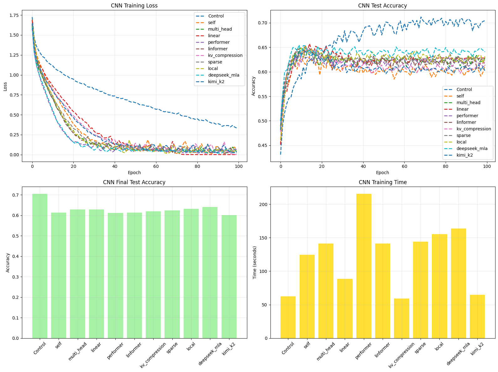
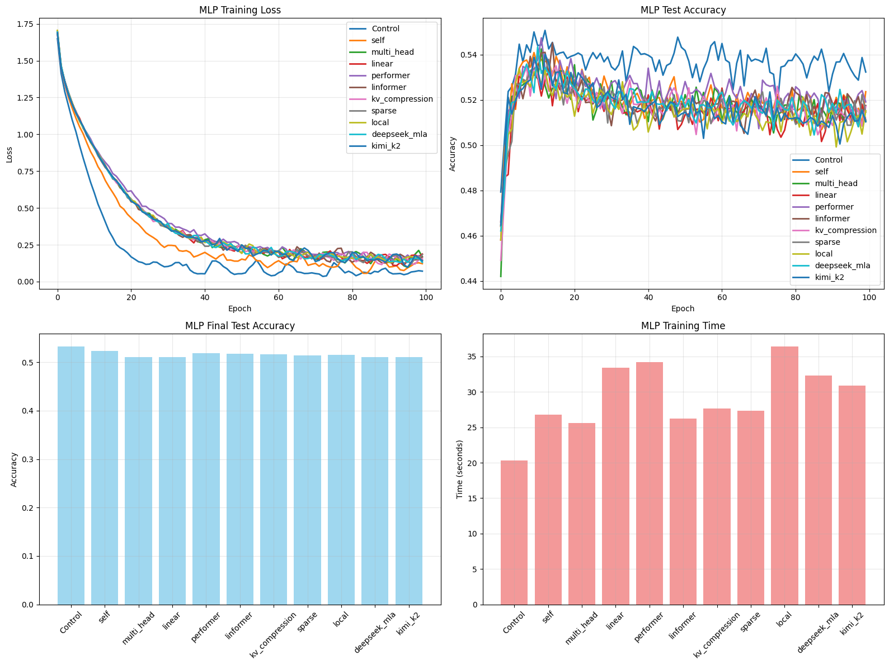

# Transformer Research

## Project Overview

In this project, I investigate 11 different attention mechanisms and their ability in image classification on the CIFAR-10 dataset. 
This investigation collects metrics on efficiency, accuracy, and robustness to provide a simple yet hollistic view of each attention mechanisms. 
While these transformers are not particularly designed for the computer vision domain, nor is the data processed in a way that would help transformers, 
this approach does offer insights and particularly an excuse for me to implement each attention mechanism and learn to do so efficiently.

## Base Architecture System

### MLP Architecture

The MLP provides a simple feedforward baseline for attention mechanism comparison. This consists of a flattened image input, followed by a hidden layer, followed
by our chosen transformer. The outputs of this transformer are then passed through an additional two hidden layers before producing logits.

**Key Features**:
- Flattens 32×32×3 CIFAR-10 images to a 3072-dimensional vector
- This tests whether attention mechanisms help feedforward architectures capture complex patterns in image data

### CNN Architecture

The CNN provides a spatially aware baseline using convolutional layers. This network begins with convolutional blocks processing the image in two distinct layers followed by image flattening.
The flattening is done to keep somewhat of an equal process between the MLP and CNN evaluations. The flattened layer then outputs to a linear layer which feeds its output
to the attention layer. Finally, a linear layer outputs the final classification logits.

**Key Features**:
- Two convolutional blocks utilize batch normalization and max pooling
- Spatial feature extraction before attention
- This tests how attention complements convolutional feature learning


## Training Process

The training process handles model initialization, optimization, and performance tracking across all attention variants.

**Key Components**:
- **Optimizer**: AdamW optimizer with configurable learning rate set to 0.001
- **Evaluation**: Separate validation on test set every epoch
- **Metrics Tracking**: Training loss, test loss, accuracy, and training time per epoch
- **Notable Optimizations**: Uses `torch.channels_last` format for CNN performance, custom dataloader for speed efficiency and process stability

Each training run is independent and provides a clean testing environment.


## Attention Mechanisms

This project implements and compares 11 different attention mechanisms, ranging from classical approaches to state-of-the-art efficient variants.

| Attention Type | Complexity | Description | Key Parameters | Theoretical Strengths | Theoretical Limitations |
|----------------|------------|-------------|----------------|---------------------|----------------------|
| **None (Control)** | O(1) | No attention mechanism | - | Fastest, no overhead, relies on architecture's inductive bias | Cannot model long-range dependencies explicitly |
| **Self-Attention** | O(n^2) | Standard scaled dot-product attention: softmax(QK^T/√d)V | `hidden_dim` | Full global receptive field, learns all pairwise interactions | Quadratic memory and compute; doesn't scale to long sequences |
| **Multi-Head** | O(n^2) | Parallel attention heads with separate Q,K,V projections | `num_heads` | Multiple representation subspaces, richer feature learning | Still O(n²); higher parameter count and memory usage |
| **Linear** | O(n) | Kernel-based reformulation: uses φ(Q)φ(K)^T instead of softmax | `num_heads`, `kernel_size` | Linear complexity; scales to very long sequences | Approximation may lose modeling power; sensitive to feature map choice |
| **Performer (FAVOR+)** | O(n) | Random Fourier features to approximate softmax kernel | `num_heads`, `num_features` | Unbiased softmax approximation; provable guarantees; O(n) complexity | Requires sufficient random features; variance in approximation quality |
| **Linformer** | O(n) | Low-rank projection of K,V: attention computed on compressed k-dim space | `num_heads`, `k`, `max_seq_len` | Reduces KV dimension; efficient for fixed-length sequences | Requires pre-specified max sequence length; projection may lose information |
| **Sparse (BigBird)** | O(n) | Structured sparsity: local + random + global tokens | `num_heads`, `block_size` | Maintains global receptive field with sparse patterns; good for long documents | Block structure may not align with data patterns; implementation complexity |
| **Local/Windowed** | O(n·w) | Attention restricted to fixed-size window around each position | `num_heads`, `window_size` | Very fast; natural for tasks with strong locality (images, audio) | Cannot capture dependencies beyond window; fails on tasks needing global context |
| **KV Compression (H2O)** | O(n^2)* | Evicts less important KV cache entries; keeps "heavy hitters" | `num_heads`, `compression_ratio` | Reduces memory footprint significantly; faster inference | Eviction strategy may drop important tokens; accuracy-memory tradeoff |
| **DeepSeek V3 (MLA)** | O(n) | Multi-head Latent Attention: low-rank KV compression + MoE | `num_heads`, `num_experts` | SOTA efficiency; combines compression with expert routing; scales well | Complex architecture; requires large scale to show benefits; routing overhead |
| **Kimi K2** | O(n^2)* | Multi-head attention + MoE gating for conditional computation | `num_heads`, `num_experts` | Adaptive capacity via expert selection; can specialize experts | MoE training instability; load balancing required; benefits need scale |
| **Flex Attention** | Variable | PyTorch native API for custom attention patterns and masks | Custom masks | Highly flexible; hardware-optimized; easy custom patterns | Requires PyTorch 2.0+; C++ compiler dependencies; platform-specific |

**Note**: Flex Attention (PyTorch native) is also added to the work, but excluded from experiments due to C++ compiler issues on Windows.


## Hyperparameter Optimization

The project used successive halving to efficiently search the hyperparameter space. The final selected configurations from the sweep are shown below:

| Attention Type | MLP Hidden | CNN Hidden | Num Heads | Attention Parameters |
|----------------|------------|------------|-----------|---------------------|
| **Control** | 512 | 512 | - | - |
| **Self-Attention** | 256 | 512 | 1 | - |
| **Multi-Head** | 256 | 512 | 2 | - |
| **Linear** | 256 | 256 | 4 | `kernel_size=128` |
| **Performer** | 256 | 512 | 8 | `num_features=64` |
| **Linformer** | 256 | 512 | 2 | `k=64`, `max_seq_len=512` |
| **KV Compression** | 256 | 256 | 4 | `compression_ratio=0.75` |
| **Sparse** | 256 | 512 | 2 | `block_size=32` |
| **Local** | 256 | 512 | 2 | `window_size=16` |
| **DeepSeek MLA** | 256 | 512 | 8 | - |
| **Kimi K2** | 256 | 256 | 4 | - |

**Common hyperparameters:** Learning rate = 0.001, Batch size = 512, Optimizer = AdamW

The parameter sweep is conducted using successive halving and a subset validation split.


## Experimental Results

The control run on CNN achieves 70.4% accuracy while the best attention variant (DeepSeek MLA) reaches 64.1%, representing a 6.4% degradation with 2.6x slower training. 
All MLP variants perform similarly (51-53%) regardless of attention mechanism, indicating attention cannot compensate for lack of spatial inductive bias.

### CNN Results (100 Epochs, CIFAR-10)



| Rank | Attention Type | Test Acc. | Train Acc. | Train Time | vs Control |
|------|----------------|-----------|------------|------------|------------|
| 1 | **Control** | **70.4%** | **89.3%** | **62s** | **Baseline** |
| 2 | DeepSeek MLA | **64.1%** | 99.3% | 164s | -6.4% |
| 3 | Local | 63.1% | 98.2% | 155s | -7.3% |
| 4 | Multi-Head | 62.9% | 98.9% | 141s | -7.6% |
| 5 | Linear | 62.8% | **100.0%** | 89s | -7.6% |
| 6 | Sparse | 62.5% | 97.3% | 144s | -8.0% |
| 7 | KV Compression | 62.0% | **100.0%** | **59s** | -8.4% |
| 8 | Linformer | 61.3% | 99.2% | 141s | -9.1% |
| 9 | Self-Attention | 61.3% | 97.8% | 124s | -9.2% |
| 10 | Performer | 61.2% | 97.7% | 215s | -9.3% |
| 11 | Kimi K2 | 60.2% | 98.6% | 65s | -10.3% |

The CNN control outperforms all attention mechanisms by 6-10% while maintaining the best generalization (18.8% train-test gap vs 35-38% for attention). 
Attention mechanisms add 1.5-3.5x computational overhead while causing severe overfitting, with most models reaching 99-100% training accuracy but only 60-64% test accuracy.

### MLP Results (100 Epochs, CIFAR-10)



| Rank | Attention Type | Test Acc. | Train Acc. | Train Time | vs Control |
|------|----------------|-----------|------------|------------|------------|
| 1 | **Control** | **53.2%** | **97.8%** | **20s** | **Baseline** |
| 2 | Self-Attention | **52.4%** | **96.2%** | 27s | -0.9% |
| 3 | Performer | 51.9% | 95.0% | 34s | -1.3% |
| 4 | Linformer | 51.8% | 94.6% | **26s** | -1.5% |
| 5 | KV Compression | 51.7% | 94.9% | 28s | -1.5% |
| 6 | Local | 51.5% | 95.3% | 36s | -1.7% |
| 7 | Sparse | 51.5% | 94.1% | 27s | -1.8% |
| 8 | Linear | 51.1% | 94.0% | 33s | -2.1% |
| 9 | Multi-Head | 51.1% | 94.6% | **26s** | -2.2% |
| 10 | DeepSeek MLA | 51.1% | 95.7% | 32s | -2.2% |
| 11 | Kimi K2 | 51.0% | 95.5% | 31s | -2.2% |

All MLP transformer variants converge to nearly identical performance (51-53%) regardless of attention mechanism, demonstrating that attention cannot compensate for the lack of spatial awareness in fully connected architectures. 
The 25-80% training time overhead from attention mechanisms provides no meaningful improvements for MLPs on image classification tasks, especially in generalization.


## Summary

This codebase implements a comparison framework for transformer attention mechanisms in computer vision. The important highlights are defined below:

### Attention Mechanisms Covered

1. **Standard O(n^2) Attention**: Self-attention, Multi-head (baseline full attention)
2. **Linear O(n) Approximations**: Linear (kernel-based), Performer (random features), Linformer (low-rank projection)
3. **Sparsity and Locality**: Sparse/BigBird (structured sparsity), Local (windowed attention)
4. **Memory Optimization**: KV Compression/H2O (cache eviction)
5. **Mixture of Experts (MoE)**: DeepSeek V3 (MLA+MoE), Kimi K2 (MHA+MoE)

### Evaluation Metrics

- **Performance**: Test accuracy, training / test loss, convergence behavior
- **Efficiency**: Training time per epoch, total training duration

### Experimental Findings

The systematic comparison revealed:
- **Attention hurts CIFAR-10 performance**: CNN control (70.4%) outperforms all attention mechanisms (60-64%) by 6-10%, this is an obvious finding
- **Inductive bias matters**: Convolutional spatial priors are more effective than learned attention for small images
- **Speed-accuracy tradeoffs**: Efficient attention variants (Linear, KV Compression) still slower than control without accuracy gains
- **MoE mechanisms underutilized**: DeepSeek and Kimi K2 require larger scale to justify routing complexity


## Citation

If you use my code in your research, please cite me:

```bibtex
@software{pjm2025TAB,
  author = {Paul J Mello},
  title = {Transformer Attention Bench},
  url = {https://github.com/pauljmello/Transformer-Attention-Bench},
  year = {2025},
}
```
